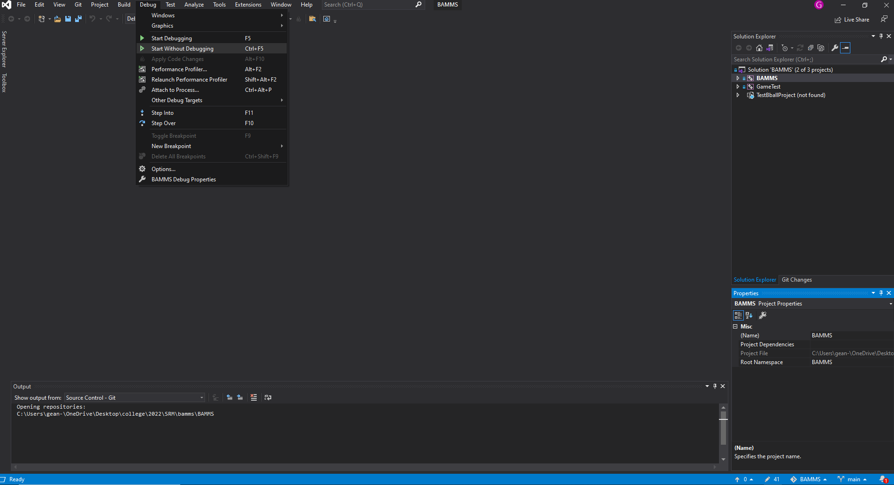
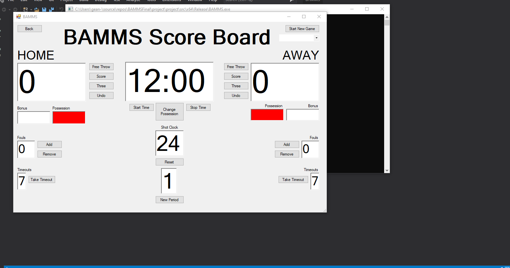
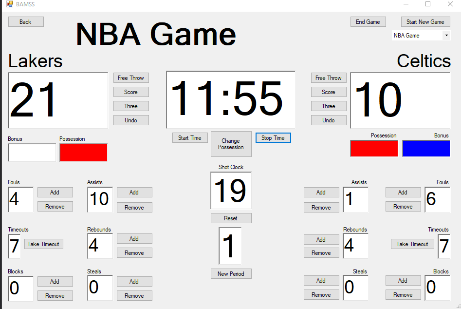
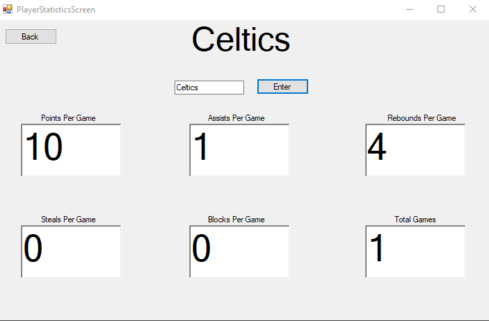

# BAMMS
BAMMS is a project created for my Intermediate Software Engineering class. BAMSS stands for Basketball Assistant with Metric Statistics and Scoreboard.
* This program has a free version which is a scoreboard application that allows for the scoring of an NBA game or a College game of basketball.
* The premium version extends the scoreboard to allow for the tracking of the stats recorded in the scoreboard using a database. As more games get
played, the stats are continually tracked for the teams created by the users. Users can then view these stats for each of the teams they create. This is tracked
for individual users since our program requires you to register and then login using a username and password. The biggest difference between the two is simply that the premium version records and tracks team statistics in the database while the free version of the program does not track anything in the database.
* There is only one program. The way to get to the premium version from the free version is simply to click the upgrade to premium button and that user will be marked as a premium user in the database, so they will be able to use the premium version, even if they log out and log back in.
* The way this project was instructed to be created is that three-tiered architecture is applied to it. That is why we have the forms, and then the DB manager serves as an intermediate to pass information to and from the forms to the database.

# Our team: Team 05

The following people worked on this project:
* Sean Maidana Dollanarte
* Lucas DeMars
* Erik Leeser
* Jacob Papenfuss

# Where are the files located? 
[https://github.com/gcmaidana/BAMMS/tree/main/BAMMS](https://github.com/gcmaidana/BAMMS/tree/main/BAMMS)

# How is the database set up?
Our database is run locally, which is why in our requirements we specify that you should be using My SQL 8.0. When we first started this project and were learning how to set up a database and make C++ and SQL work together, we came across this YouTube video below. As you can see in the video below, MySQL Server and MySQL Connector are both downloaded together, and you set up the server locally after downloading. As you can see in [this file on line 25](https://github.com/gcmaidana/BAMMS/blob/main/BAMMS/DBManager.cpp) we just used "root" as the username and "password" as the password for our database server. We kept it simple so that everyone in the group could work together without any database credentialing issues, especially since we were sharing files.

[YouTube Video for setting up MySQL: https://www.youtube.com/watch?v=yNniOHn9Xe0&t=1108s](https://www.youtube.com/watch?v=yNniOHn9Xe0&t=1108s)

# How are the database tables created?
Since our database is run locally, you need to execute a script in the MySQL 8.0 Command Line Client. After you log into the server, you can type in SQL queries to create the table you want. Refer to the [Table Creation Script for the tables we created for this specific program](https://github.com/gcmaidana/BAMMS/blob/main/BAMMS/TableCreationScript.cpp). You must create these tables before you run the program so that the database can track users and team stats. Otherwise of course the database would not be tracking anything.

# Running the program
To run the program, click Debug at the top of Visual Studio, then click Start without Debugging. Alternatively, you can use the shortcut Ctrl+F5. To avoid running into 
problems, make sure you are using Visual Studio 2019 Community Edition.

# How are team stats calculated?
The way we calculated team stats is just by taking the total number of points (or fouls or rebounds, etc.) and dividing it by the total number of games a team has played.

# My Contribution
Although the files say what each individual worked on, I am making a list about what I worked on since this project has a lot of files. 
* The landing page form that is the first thing a user sees and allows them to select to either login or register.
* The login and register forms and their respective functionalities with the database to track new or existing users. There's also error checking, for example, a user cannot create a username that already exists. It will also let the user know if a username does not exist when trying to log in and or when the username does exist but the password is incorrect.
* The form for choosing a team when a premium user starts a game (they have to name the teams in order to start the game).
* The backend of the program, so the database manager CPP and H files.
* Pushing to the database when a game ends for the premium version in the ScoringScreenPremium.h
* I did not work on the scoreboard or anything related to the rules because I have no knowledge of basketball rules.

# Requirements

* Visual Studio 2019
* Most Recent .NET Package
* Most Recent CLI Support
* My SQL 8.0

# Screenshots

* This is what the free version of the program looks like. It is just a scoreboard. No database tracking.
 
 
 

* This is what the premium version of the program looks like. As you can see, you can specify the team names that will be entered in the database. After you click end game in the top right corner, each team's stats will be pushed to the database for that particular game.

 
 

* After a team has played a game in the premium version, you can then look up that team's stats.

 
 

